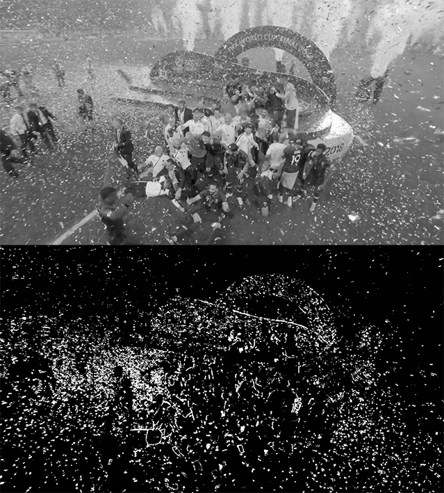

# AutoVMAF Preprocessing

Python script to analyzes a video via a combination of motion and sharpness to determine the most suitable section to be used for VMAF analysis.

The output is a time-code of the frame that contains the most motion and finer details. This can for example be confetti, particles, tree leaves, etc.

Example of a processed frame:
The tool converts motion pixels to white and everything else to black pixels. 
The percentage of white pixels in the frame and the overall sharpness of the original frame (how much that is in focus) is then calculated per frame and then compared it to the next frame and so on.



## Usage 

Example:
```python
from .src.analyze import video_analyzer

threshold = 4 # Motion threshold (higher = more motion required) (default: 4)
timecode = video_analyzer(file_path="video.mp4", threshold=threshold)

print(timecode) # HH:MM:SS:FF
```

An exampe CLI have also been provided that prints the timecode to the console.

```bash
python cli.py -f video.mp4 
```
